# Software Design Patterns

| Creational               | Structural               | Behavioral               |
|--------------------------|--------------------------|--------------------------|
| Singleton Pattern        | Adapter Pattern          | Observer Pattern         |
| Factory Method Pattern   | Decorator Pattern        | Stratergy Pattern        |
| Abstract Factory Pattern | Proxy Pattern            | Interpreter Pattern      |
| Builder Pattern          |                          | Mediator Pattern         |
| Prototype Pattern        |                          |                          |

## Creational Design Patterns

Creational design patterns deal with the process of object creation, providing ways to instantiate objects while hiding the details of the instantiation process. These patterns help make a system independent of how its objects are created, composed, and represented, and they promote flexibility and reuse.

## Structural Design Patterns

Structural design patterns are concerned with composing classes and objects to form larger structures, allowing for more flexible and efficient systems. These patterns focus on simplifying the composition of subsystems by identifying simple ways to realize relationships between different entities. Structural patterns help ensure that the components of a system are easily extendable and can work together seamlessly.

## Behavioral Design Patterns

Behavioral design patterns are dedicated to defining the ways in which objects interact and communicate with one another. These patterns address the delegation of responsibilities between objects and the flow of communication, allowing for more flexible and efficient collaboration. Behavioral patterns help design systems where the interaction between objects is dynamic and can change during runtime, providing a more adaptable and maintainable architecture.

# UML diagrams of design patterns

## Singleton
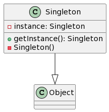

## Enum Singleton
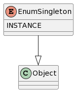

## Simple Factory
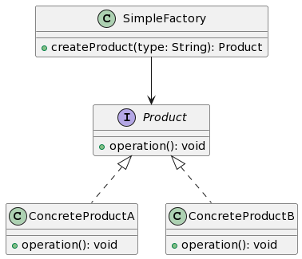

## Factory
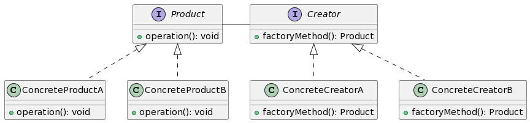

## Abstract Factory
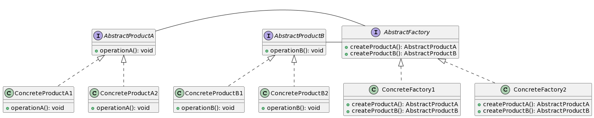

## Decorator
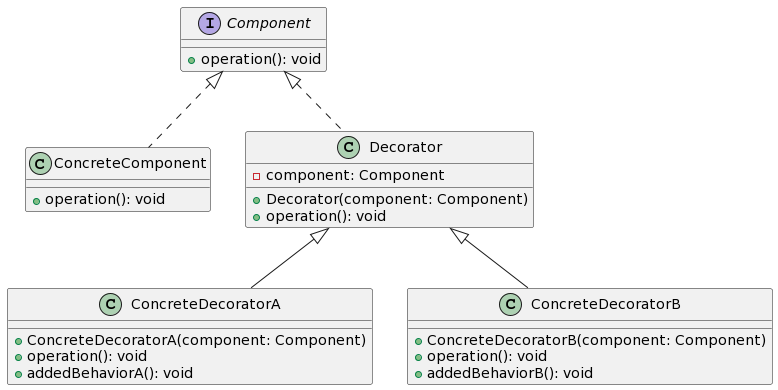

## Class Adapter
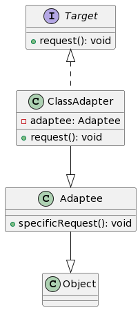

## Object Adapter
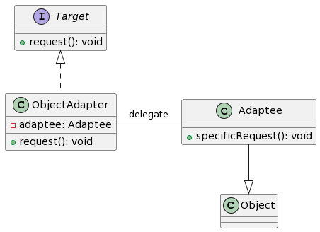

## Builder
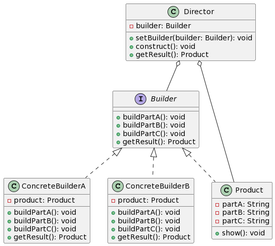

## Mediator
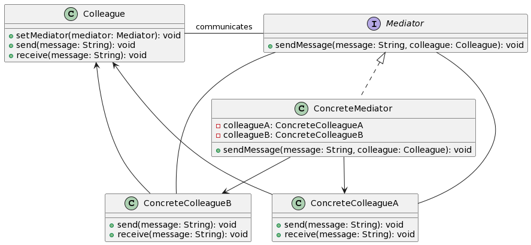

## Strategy
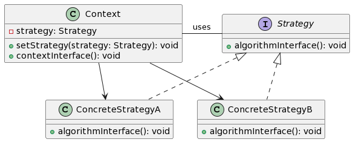

## Facade
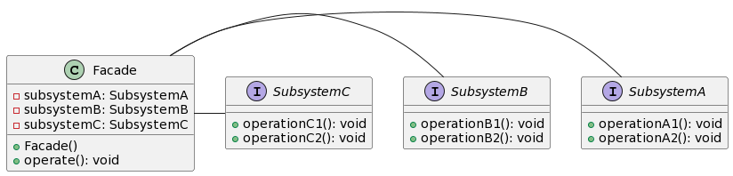

## Facade Subsystem
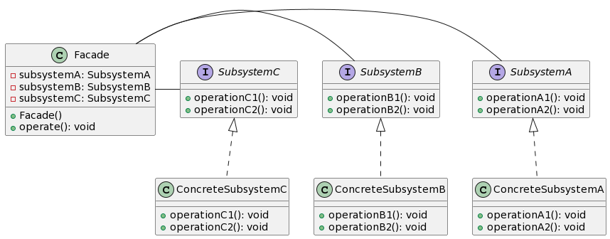

## Iterator
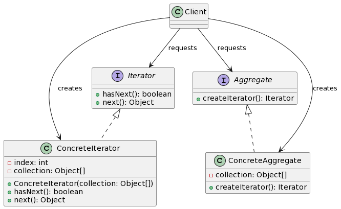

## Class Bridge
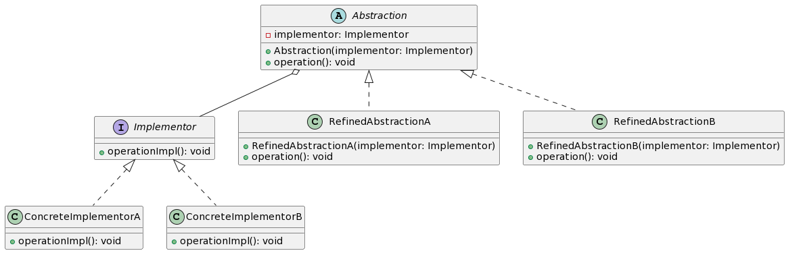

## Object Bridge
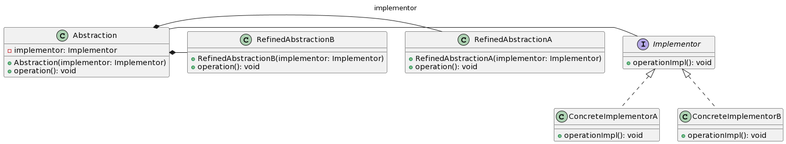